# WebSocket Real-Time Communication Guide

## What is WebSocket? (The Simple Explanation)

Think of WebSocket as a **phone call** between your browser (the website) and the server (backend). Unlike regular HTTP requests which are like sending a letter and waiting for a reply, WebSocket keeps the line open so both sides can talk anytime.

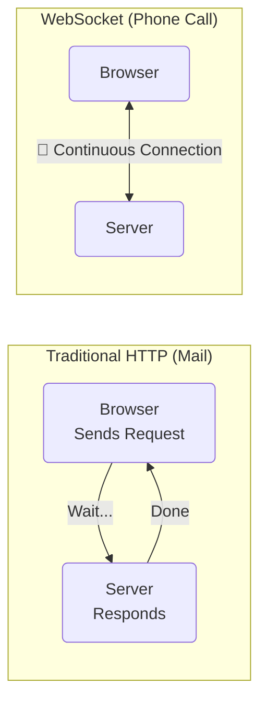

---

## Why Do We Need WebSocket?

### The Problem: Real-Time Updates

Imagine you're a **Doctor** using our platform:

- A critical patient case gets flagged as "Urgent"
- Another doctor refers a patient to you
- A patient's status changes from "Pending" to "Under Review"

**Without WebSocket:** You'd have to refresh the page constantly to see updates

**With WebSocket:** Updates appear instantly, like a text message notification

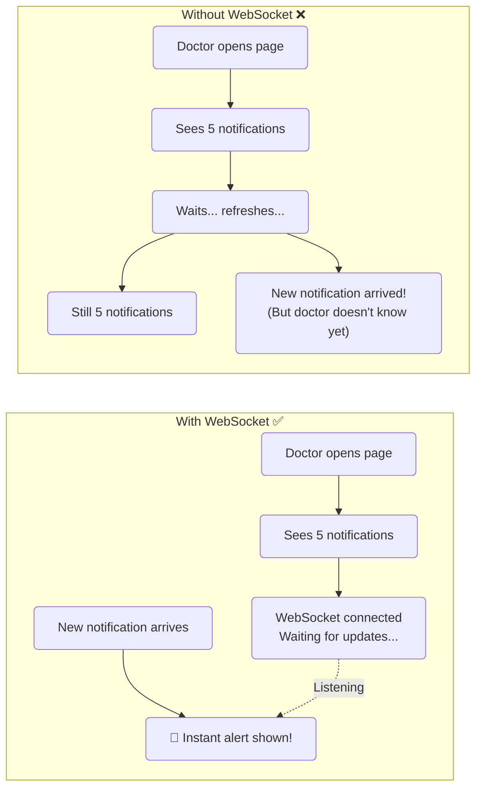

---

## Our Communication Channel: STOMP WebSocket

We use a single **STOMP WebSocket** connection for all real-time features.

**Think of it like:** A hospital intercom system with different channels for different departments.

Each user connects once, then subscribes to the channels relevant to their role:

```mermaid
%%{init: {'flowchart': {'useMaxWidth': true}}}%%
flowchart LR
    classDef default rx:5,ry:5

    U["User Browser"] -->|"Connect<br/>/ws/notifications<br/>+ Subscribe to topics"| S["Server"]
    S -->|"/user/queue/notifications"| U
    S -->|"/topic/provider/{id}/urgent"| U
    S -->|"/topic/provider/{id}/notifications"| U
    S -->|"/topic/provider/{id}/patients"| U
    S -->|"/topic/curator/patient-results"| U
    S -->|"/topic/school/{id}/patient-results"| U

   style U fill:#1f592a
    style S fill:#231f59
```

---

## Understanding Topics (STOMP Channels)

Topics are like **radio channels**. You tune in to the channels relevant to you:

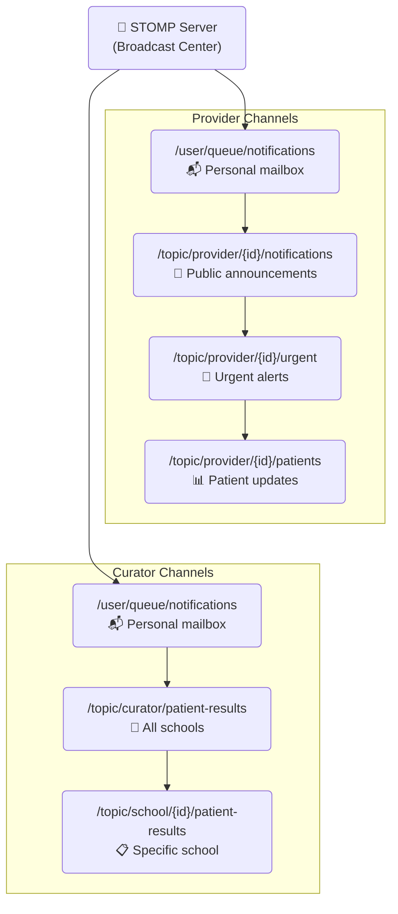

---

## The Complete Flow: From Login to Real-Time Updates

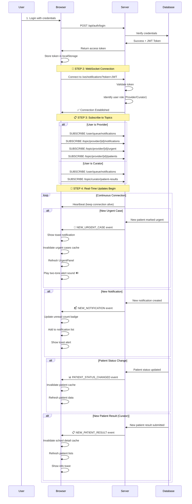

---

## Message Types Explained

### 1. 🔌 Raw WebSocket Events

#### CONNECTED (First Message)

```json
{
  "event": "CONNECTED",
  "timestamp": "2026-04-11T10:00:00",
  "userId": "a145c8f7-0f22-4e9f-b8cf-f0a74fb96c39",
  "role": "ROLE_PROVIDER"
}
```

**What it means:** "You're connected! Here's who you are."

#### NEW_NOTIFICATION

```json
{
  "event": "NEW_NOTIFICATION",
  "timestamp": "2026-04-11T10:01:00",
  "recipientId": "a145c8f7-0f22-4e9f-b8cf-f0a74fb96c39",
  "unreadCount": 4,
  "notification": {
    "id": "f9ad16f6-6f73-4f0e-b335-801d3f95d1ec",
    "type": "PATIENT_REFERRED",
    "title": "Patient Referred",
    "message": "Dr. Smith referred patient Jane Doe to you."
  }
}
```

**What it means:** "You have a new notification! Your total unread count is now 4."

#### UNREAD_COUNT_CHANGED

```json
{
  "event": "UNREAD_COUNT_CHANGED",
  "timestamp": "2026-04-11T10:03:00",
  "unreadCount": 0
}
```

**What it means:** "You marked some notifications as read. You now have 0 unread."

---

### 2. 📡 STOMP Topic Events

#### Provider Urgent Case Alert

```json
{
  "type": "NEW_URGENT_CASE",
  "patient": {
    "patientId": 456,
    "patientName": "Jane Doe",
    "score": 91.5,
    "status": "urgent",
    "schoolId": 12,
    "schoolName": "Lincoln High",
    "time": "2026-04-11T10:05:00",
    "preview": "Initial triage note..."
  }
}
```

**What it means:** "🚨 URGENT! Patient Jane Doe from Lincoln High needs immediate attention!"

#### Provider Patient Status Change

```json
{
  "type": "PATIENT_STATUS_CHANGED",
  "patient": {
    "patientId": 456,
    "patientName": "Jane Doe",
    "score": 91.5,
    "status": "reviewed",
    "schoolId": 12,
    "schoolName": "Lincoln High"
  }
}
```

**What it means:** "Patient Jane Doe's status changed from 'urgent' to 'reviewed'."

#### Curator New Patient Result

```json
{
  "type": "NEW_PATIENT_RESULT",
  "schoolId": 12,
  "patientName": "Jane Doe",
  "patientResultId": 456,
  "lockinId": 789,
  "createdAt": "2026-04-11T10:05:00"
}
```

**What it means:** "A new patient result was submitted at Lincoln High."

---

## How Messages Travel: The Journey of a Notification

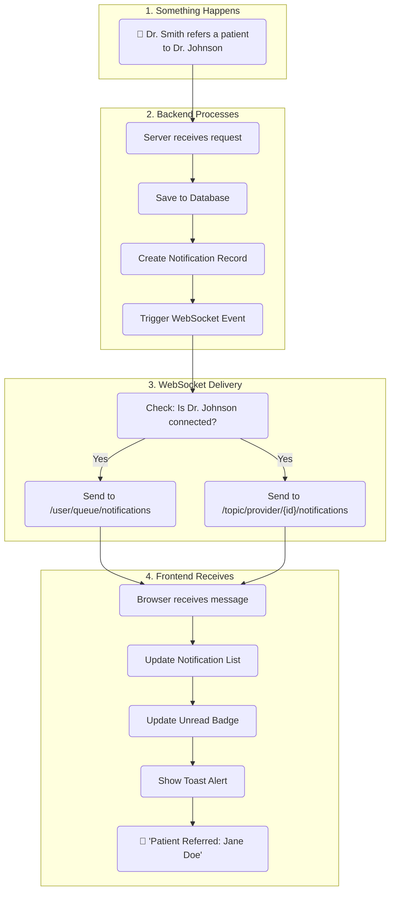

---

## Connection Lifecycle

```mermaid
%%{init: {'stateDiagram': {'useMaxWidth': true}}}%%
stateDiagram-v2
    [*] --> Disconnected : User opens app
    Disconnected --> Connecting : User logs in

    Connecting --> Connected : Auth success
    Connecting --> Error : Invalid token / Network error

    Connected --> Receiving : Subscribed to topics
    Receiving --> Receiving : New message arrives

    Connected --> Disconnected : Tab closed / Network lost
    Receiving --> Disconnected : Connection lost

    Error --> Connecting : Retry with backoff
    Disconnected --> Connecting : Auto-reconnect attempt

    Connected --> [*] : User logs out
```

---

## Reconnection Strategy

What happens when your internet hiccups? We've got you covered:

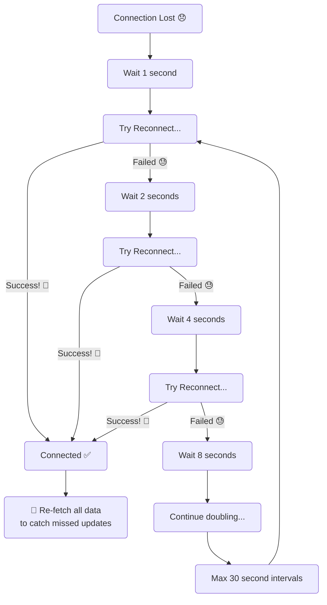

**Why this matters:** If you're offline for 5 minutes and 3 urgent cases come in, we'll reconnect and fetch everything you missed!

---

## Authentication: How We Know It's Really You

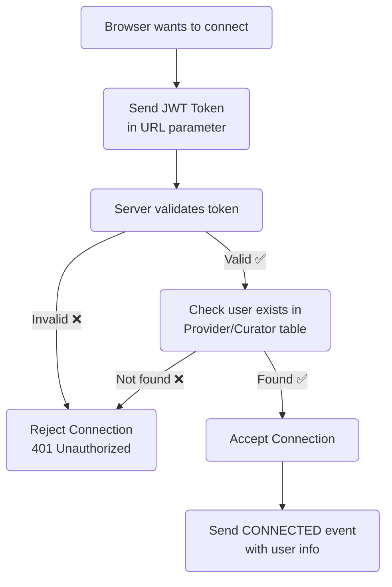

**Security Note:** The token travels in the URL query parameter (`?token=xxx`) because WebSocket handshake headers are limited in browser environments.

---

## Visual: What Users See

### Provider Dashboard with WebSocket

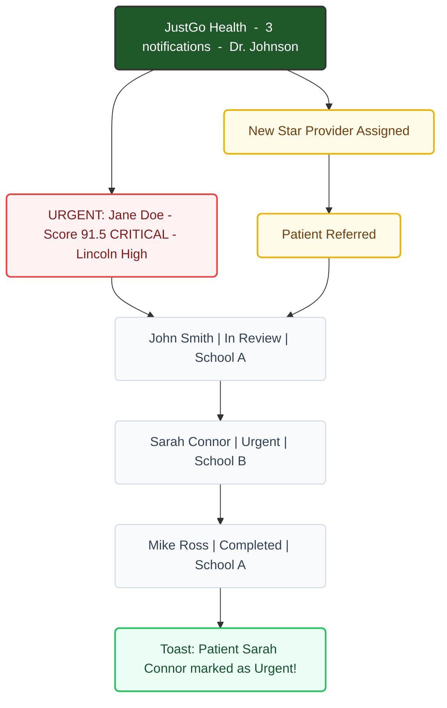

---

## Common Scenarios

### Scenario 1: New Provider Logs In

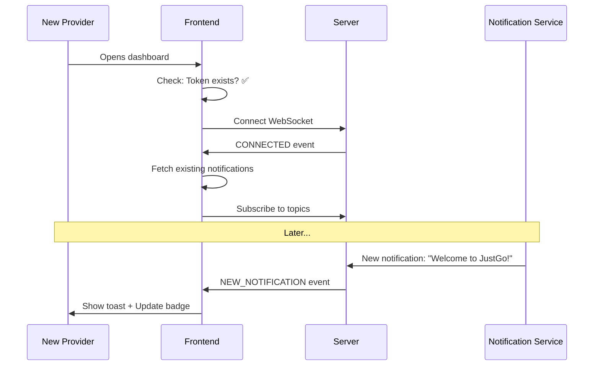

### Scenario 2: Curator Monitors Multiple Schools

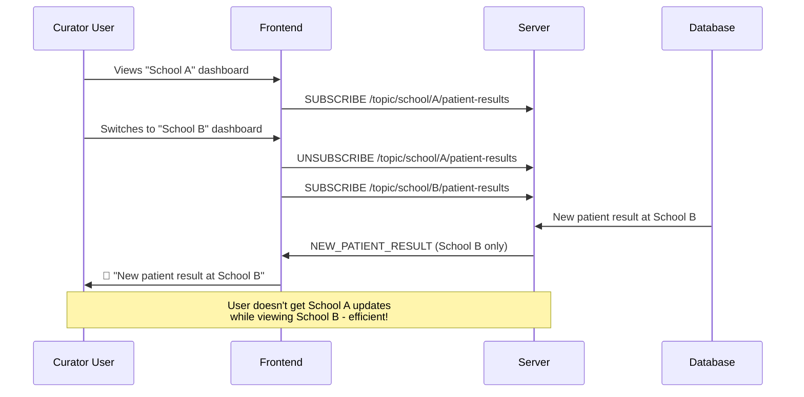

### Scenario 3: Network Interruption

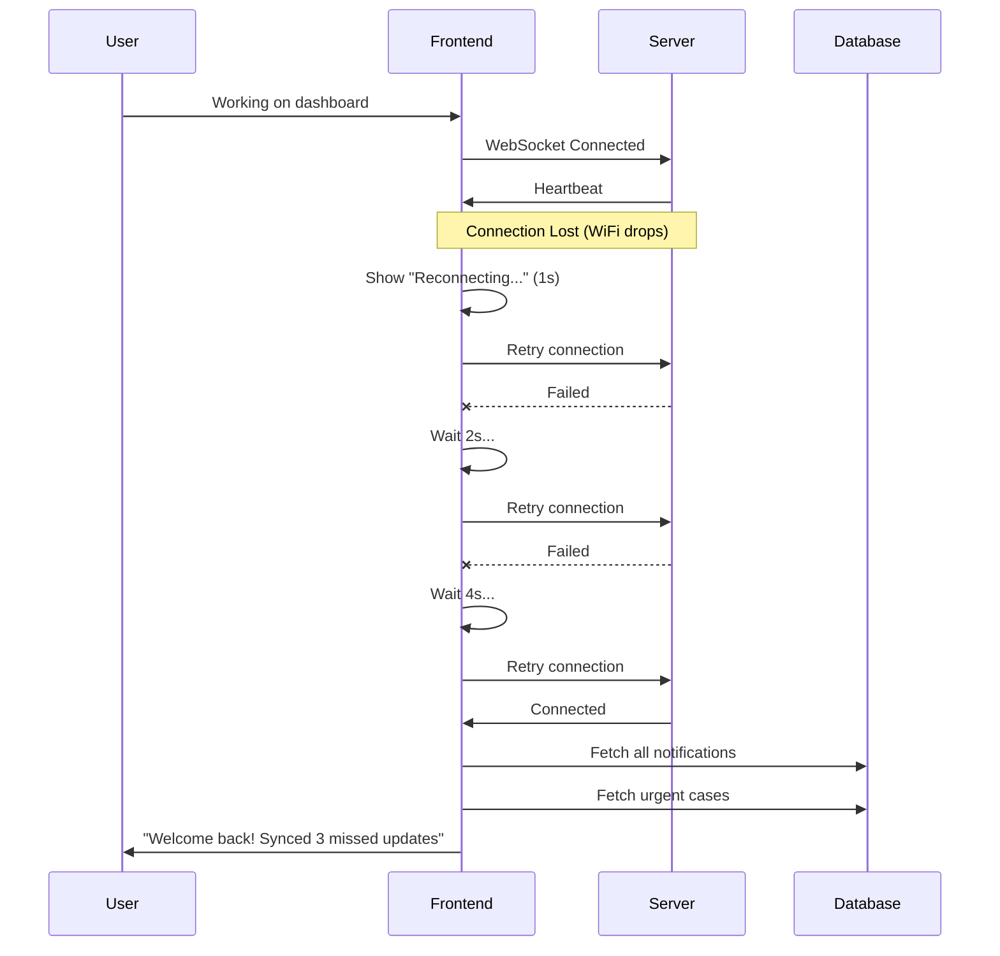

---

## Technical Architecture Overview

### Frontend Files

```
src/
├── services/websocket/
│   ├── stomp-client.ts              ← STOMP connection manager (singleton)
│   └── subscription-manager.ts      ← Topic subscriptions & event routing
├── hooks/
│   ├── use-stomp-websocket.ts       ← Main WebSocket connection hook
│   ├── use-notification-websocket.ts ← Notification handling (Provider + Curator)
│   ├── use-urgent-cases-websocket.ts ← Urgent case alerts + audio beep
│   ├── use-patient-status-websocket.ts ← Patient status changes
│   ├── use-patient-result-websocket.ts ← New patient results (Curator)
│   └── use-school-subscription.ts   ← Dynamic per-school subscriptions
└── components/providers/
    └── stomp-provider.tsx           ← WebSocket context provider (initializes all hooks)
```

### How They Work Together

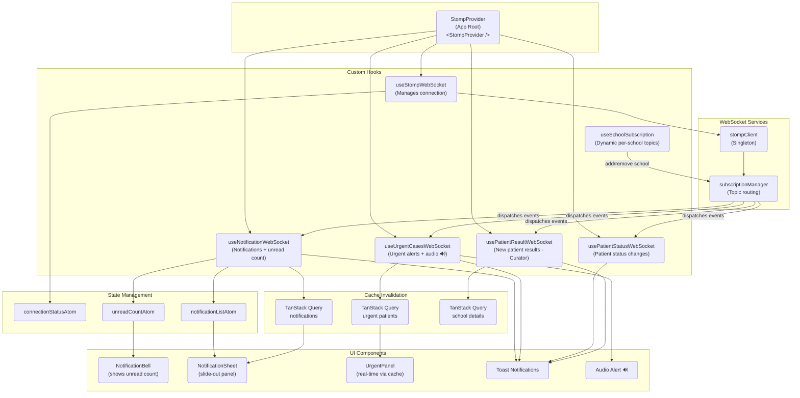

### Complete Event Pipeline

This diagram traces **every event** from the backend through to the final UI rendering:

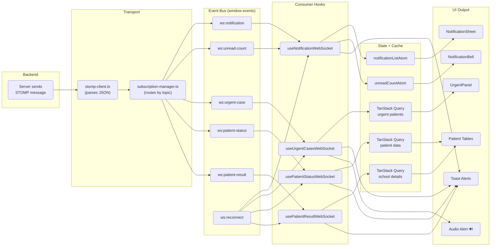

---

## Troubleshooting Guide

### "I'm not getting notifications!"

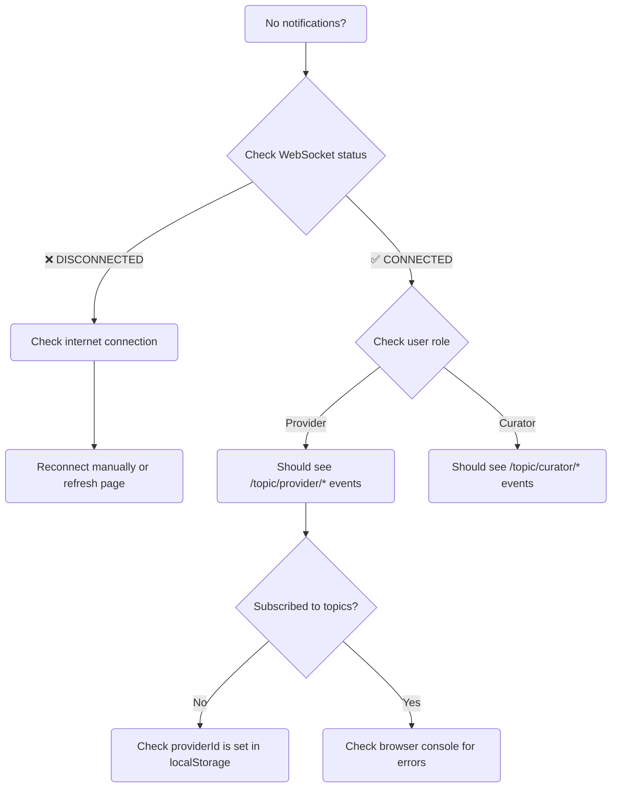

### "Notifications are delayed"

| Possible Cause        | Solution                                            |
| --------------------- | --------------------------------------------------- |
| Network latency       | Check WiFi/cellular connection                      |
| Browser in background | Some browsers throttle background tabs              |
| Server load           | Notifications may take 1-5 seconds during high load |

### "I see duplicate notifications"

This happens when:

1. You have multiple tabs open (each connects separately)
2. You reconnected and old + new notifications merged

**Fix:** Page refresh clears duplicates

---

## Quick Reference: Event Types

| Event                    | When It Fires            | Who Receives It               | Frontend Action                              |
| ------------------------ | ------------------------ | ----------------------------- | -------------------------------------------- |
| `CONNECTED`              | WebSocket first connects | Everyone                      | Set connection status                        |
| `NEW_NOTIFICATION`       | New notification created | Intended recipient            | Toast + update sheet + update badge          |
| `UNREAD_COUNT_CHANGED`   | Unread count updates     | The user                      | Update unread badge                          |
| `NEW_URGENT_CASE`        | Patient marked urgent    | Assigned provider             | Toast + audio alert 🔊 + refresh UrgentPanel |
| `PATIENT_STATUS_CHANGED` | Patient status updates   | Assigned provider             | Toast + refresh patient list                 |
| `NEW_PATIENT_RESULT`     | New result submitted     | Curators watching that school | Toast + refresh school patient lists         |

---

## Security Best Practices

1. **Token Expiration:** JWT tokens expire after a set time. WebSocket will auto-reconnect with a fresh token.

2. **Role Verification:** Server checks if you're actually a Provider/Curator before allowing connection.

3. **No Sensitive Data:** Notifications show summaries, not full patient records.

4. **Automatic Cleanup:** When you logout or close the tab, WebSocket disconnects immediately.

---

## Glossary

| Term             | Simple Explanation                                                    |
| ---------------- | --------------------------------------------------------------------- |
| **WebSocket**    | A persistent connection between browser and server for real-time data |
| **STOMP**        | A protocol (like a language) that runs over WebSocket for messaging   |
| **Topic**        | A channel name like a radio station - you subscribe to get messages   |
| **JWT Token**    | Your digital ID card that proves who you are                          |
| **Heartbeat**    | Periodic "ping" to keep connection alive                              |
| **Payload**      | The actual data/content of a message                                  |
| **Atom**         | A piece of shared state (like unread count) that updates everywhere   |
| **Subscription** | Telling the server "I want messages on this topic"                    |

---

## Summary

### For Providers:

- WebSocket keeps you updated on **urgent cases** and **patient referrals**
- You'll get instant alerts (visual toast + audio beep 🔊) when a patient needs urgent attention
- UrgentPanel refreshes automatically when new urgent cases arrive
- No need to refresh the page - updates appear automatically

### For Curators:

- Monitor **new patient results** across all schools in real-time
- Get notified when schools submit new data (toast + badge)
- Per-school subscriptions activate automatically when viewing a school detail page
- Dashboard stays current without manual refreshing

### For Everyone:

- WebSocket = **Live updates** without page refresh
- Single **STOMP** connection handles all real-time features
- Auto-reconnects if connection drops (exponential backoff)
- On reconnect, all data is automatically re-fetched to catch missed updates
- All authentication is handled automatically

---

_Last Updated: April 2026_
_Questions? Contact the development team_
